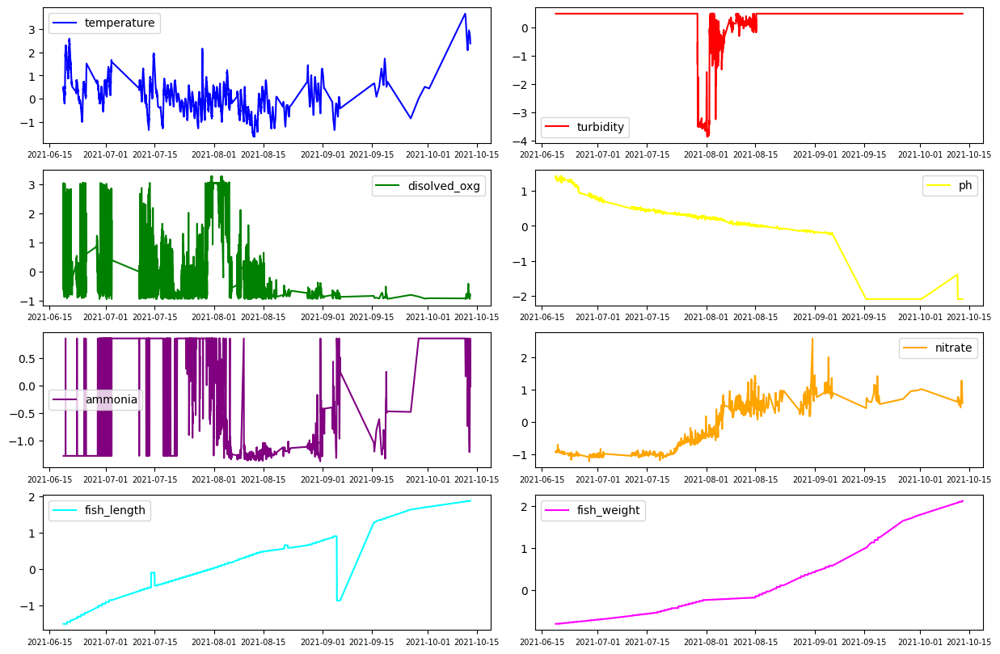
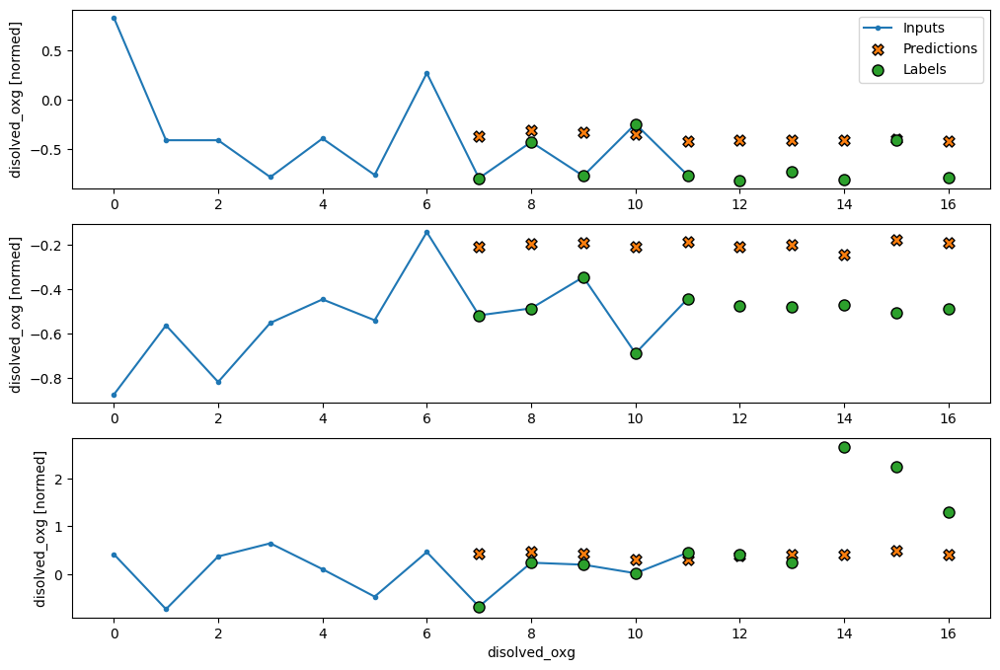
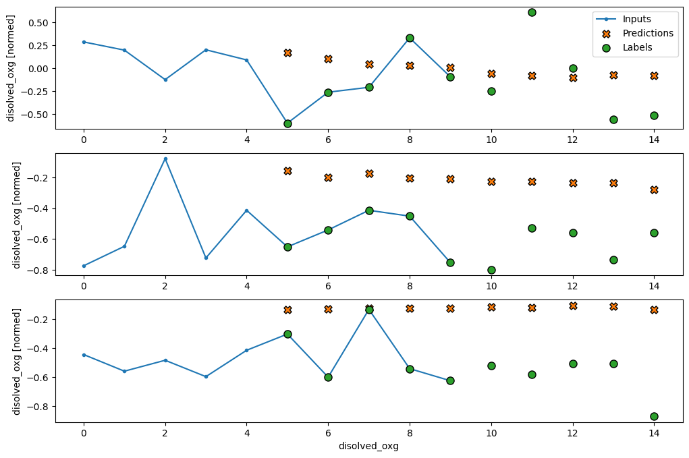
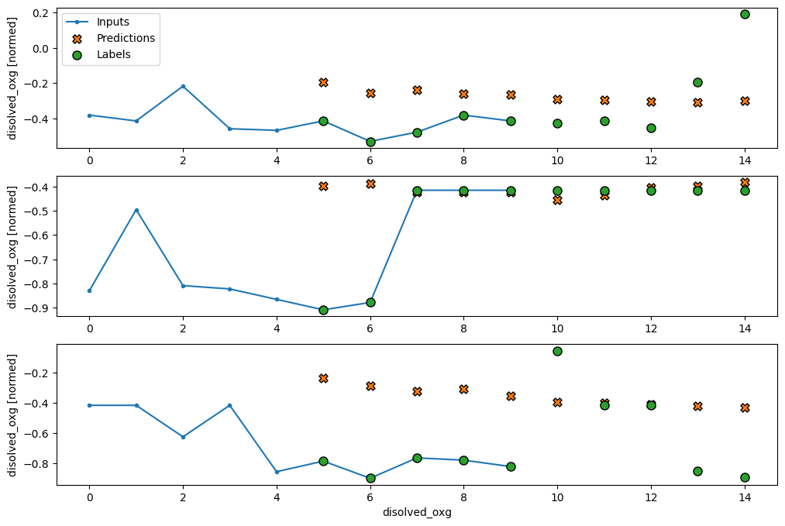
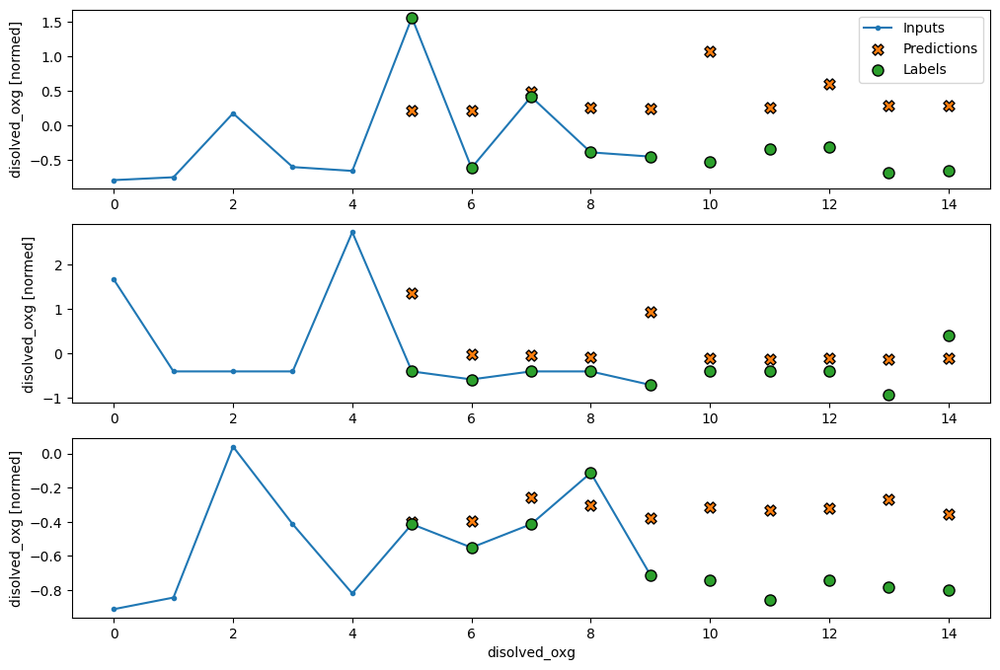
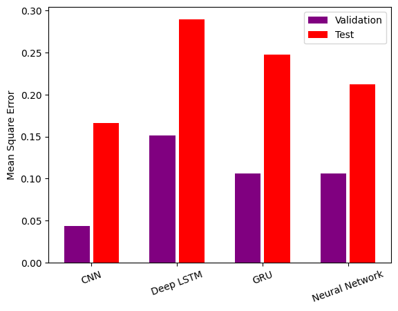

# FreFish Ltd Pond and Cages Datasets Forecasting Model

## Overview
This project aims to forecast various parameters in an FreFish Ltd pond and Cages system using different machine learning models. The models used include Convolutional Neural Networks (CNN), Long Short-Term Memory (LSTM) networks, Gated Recurrent Units (GRU), and traditional Neural Networks.

## Data Used
The dataset used in this project consists of various parameters collected from an FreFish Ltd pond and Cages system. The parameters include:
- Water temperature
- pH level
- Dissolved oxygen
- Ammonia levels
- Nitrate levels
- Fish growth metrics
- Feeding rates
- Other relevant environmental factors

## Features
The features used for forecasting include:
- Historical data of the parameters mentioned above
- Time-based features such as day of the week, month, etc.
- External factors that might influence the pond environment

## Architectures
### 1. Convolutional Neural Network (CNN)
The CNN model uses 1D convolutional layers to capture temporal patterns in the data. The architecture includes:
- Conv1D layers with SELU activation
- MaxPooling layers
- Dense layers with PReLU activation and Dropout for regularization

### 2. Deep LSTM
The LSTM model is designed to capture long-term dependencies in the time series data. The architecture includes:
- LSTM layers with ReLU activation
- Dense layers with PReLU activation and Dropout for regularization

### 3. GRU
The GRU model is similar to the LSTM model but uses GRU layers instead. The architecture includes:
- GRU layers with ReLU activation
- Dense layers with PReLU activation and Dropout for regularization

### 4. Neural Network
A traditional feedforward neural network is also used for comparison. The architecture includes:
- Dense layers with ReLU activation
- Dropout layers for regularization

## Results
The performance of each model is evaluated using Mean Squared Error (MSE) on both validation and test datasets. The results are summarized as follows:

| Model           | Validation MSE | Test MSE |
|-----------------|----------------|----------|
| CNN             | val_MSE_cnn    | test_MSE_cnn |
| Deep LSTM       | val_MSE_lstm   | test_MSE_lstm |
| GRU             | val_MSE_gru    | test_MSE_gru |
| Neural Network  | val_MSE_nn     | test_MSE_nn |

## Visualizations

> _**Figure**_: Features or change of parameter values With Time


> _**Figure**_: Results with CNN Model


> _**Figure**_: Results with Deep LSTM Visualization Model


> _**Figure**_: Results with GRU Visualization Model


> _**Figure**_: Results with Full connected Neural Network


> _**Figure**_: Comparision Between all models


### 1. Training History
The training history of each model is plotted to show the loss and mean absolute error over epochs.

```python
plot_history(history1.history)